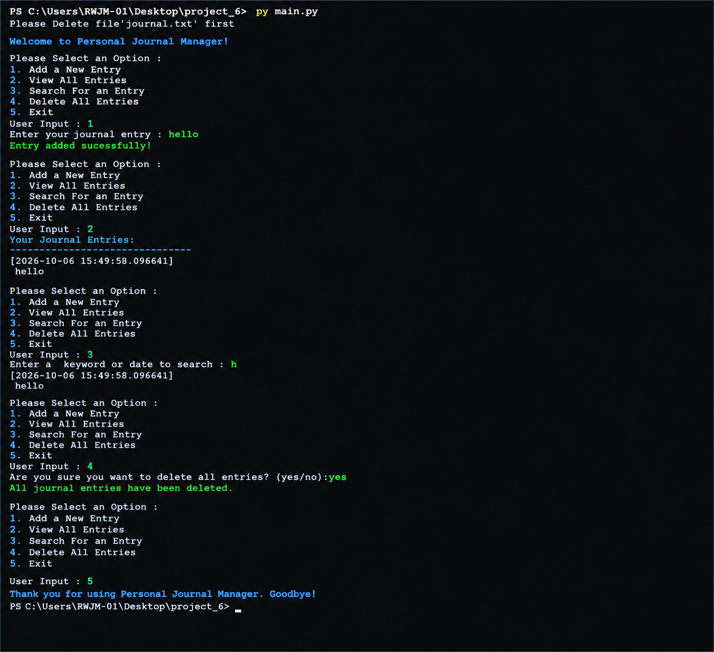

# Personal Journal Manager

A simple **Python-based Personal Journal Manager** that allows users to create, view, search, and delete journal entries through a command-line interface.

## Features

* Add a new journal entry
* View all saved journal entries
* Search entries using a keyword or date
* Delete all journal entries
* Exit the application
* Automatically records the date and time of each entry
* Stores journal data in a text file

## Menu Options

When the program starts, the following menu is displayed:

```text
1. Add a New Entry
2. View All Entries
3. Search For an Entry
4. Delete All Entries
5. Exit
```

### 1. Add a New Entry

Allows the user to enter a new journal entry.

Example:

```text
Enter your journal entry : hello
Entry added successfully!
```

The entry is saved along with its date and time.

### 2. View All Entries

Displays all journal entries stored in the journal file.

Example:

```text
Your Journal Entries:
-------------------------------
[2026-10-06 15:49:58.096641]
hello
```

### 3. Search For an Entry

Allows the user to search for an entry using a **keyword or date**.

Example:

```text
Enter a keyword or date to search : h

[2026-10-06 15:49:58.096641]
hello
```

### 4. Delete All Entries

Deletes all saved journal entries after asking for confirmation.

Example:

```text
Are you sure you want to delete all entries? (yes/no): yes
All journal entries have been deleted.
```

### 5. Exit

Closes the application.

```text
Thank you for using Personal Journal Manager. Goodbye!
```

## Requirements

* Python 3.x
* No external Python libraries are required.

## Project Structure

```text

│
├── main.py
├── journal.txt
├── output.png
└── README.md
```

> `journal.txt` is used to store the journal entries. It may be created automatically when the program adds its first entry.

## How to Run

1. Install Python 3 if it is not already installed.

2. Open PowerShell or Command Prompt.

3. Navigate to the project folder:

```powershell
cd C:\Users\RWJM-01\Desktop\project_6
```

4. Run the program:

```powershell
py main.py
```


## Output


## Example Workflow

```text
Welcome to Personal Journal Manager!

Please Select an Option :

1. Add a New Entry
2. View All Entries
3. Search For an Entry
4. Delete All Entries
5. Exit

User Input : 1
Enter your journal entry : hello
Entry added successfully!

User Input : 2

Your Journal Entries:
-------------------------------
[2026-10-06 15:49:58.096641]
hello

User Input : 3
Enter a keyword or date to search : h

[2026-10-06 15:49:58.096641]
hello

User Input : 4
Are you sure you want to delete all entries? (yes/no): yes
All journal entries have been deleted.

User Input : 5

Thank you for using Personal Journal Manager. Goodbye!
```

## Technologies Used

* **Python**
* **File Handling**
* **Datetime**


## Learning Objectives

This project demonstrates basic Python programming concepts, including:

* Functions
* Loops
* Conditional statements
* User input
* File handling
* String searching
* Date and time handling
* Exception/error handling

## Author

**Dal Adnan**

